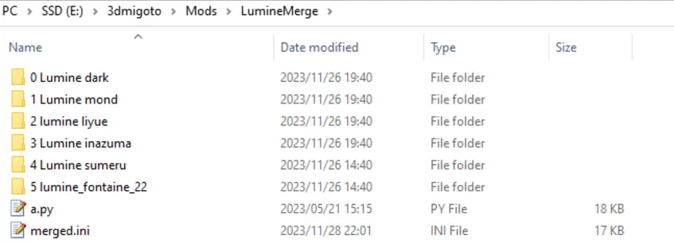

# Preface 
This guide explain how region detection works and provide the simplest way to make a region-based outfit swap. You can (and is encourage to) make more variation if you have a good understand of the coding progress.

# Preparation
Guide written and original idea by [golanah921](https://gamebanana.com/members/2574517)
- `Region.ini` file and a `working merge mod` are required, the file can be obtain via either by the original mod post on game banana or leotorrez’s github using the below URLs

    - Original post: https://gamebanana.com/tools/15459
    - leotorrez’s github: http://github.com/LeoTorreZ/LeoTools/blob/main/guides/RegionCheckGuide.md

- Region.ini
    - Download link: [Region.ini](http://github.com/LeoTorreZ/LeoTools/blob/main/releases/Region.ini)

- Merge mod can be made by either of the following tutorials, just make sure to use the naming format that will be elaborate later in this guide
    - [Video Tutorial by Kushala](https://www.youtube.com/watch?v=r-zddzU5fkg)
    - [Written Tutorial by the SilentnightSound (author of the merge script)](https://gamebanana.com/tools/11165)

# The correct setting
- Put your `Region.ini` file in the folder `/Mods/BufferValues` to ensure you only have 1 copy of this file in your `/Mods` folder and to make it easier to update in the future.
- Put your merge mod anywhere in `/Mods` folder. (`Region.ini` is global so it will work regardless of where your mod is.)

Name the merge mod sub folder with number in order of 0, 1, 2… format. This will help you know which value is correspond to which outfit later. 
### IMPORTANT: Only rename your folder before creating a merge mod's merge.ini and not after else the merge mod won’t work.

  

# How does region detection work?
The region detection is done using region specific item (party setup screen, local specialty and local item) of each region and loading screen icon of each region. This means that sometime even if you have changed region, if you had not encounter an item listed above, the region detection will not identify as you having changed region.
You can immediately get the correct region by using teleport to any location or open the party setup screen. 

# Region variable
The current region is identified by the Region.ini file, and you can access to it in your merged.ini using the variable `$\global\region\regioncheck`. This will return a number which correlated to each region in the game. The meaning of each number will be written at the beginning of `Region.ini` file. 

At the time of this tutorial, it is as below, but always check your `Region.ini` file to be sure.

```ini
; Regioncheck cheat sheet:
;
; 0: region unidentified
; 1: mondstadt
; 2: liyue
; 3: inazuma
; 4: sumeru
; 5: fontaine
```

You can either use the variable as `$\global\region\regioncheck` by itself, or assign it to another variable. For example, with the below code you can call the current region using the variable `$regioncheck` instead. This method can help with the readability of your code.

```ini
...
global $regioncheck = $\global\region\regioncheck
...
```

# Outfit variable
The outfit of your character is often represented by the variable `$swapvar`. This is where the naming of subfolder becomes important. If you named it as specified above, the value of the `$swapvar` variable correspond the number of your folder. For example `$swapvar` is 0 mean outfit in folder with 0, `$swapvar` is 1 for outfit in folder with 1 and so on.

# Condition code
As you will want to set a condition for each outfit (`$swapvar`) to respone to each region (`$\global\region\regioncheck`) a condition code will be used. The basic for this can be found with one click on google.
Since we are going for the simplest form, the word you need to know are only `if`, `endif` (without space).  For every `if`, there will be an `endif`, between those two, we will have an action.

 Your code would have the logic as following
```
if current region is A
    turn outfit to a
endif

if current region is B
    turn outfit to b
endif

and so on for every region you want outfit change at.
```
# Assigns outfit to specific region.

Open your `merge.ini` and scroll down to the end of the [Present] section. Your code will be added there.

  

The code you use is as below
```ini
if $\global\region\regioncheck == 1
	$swapvar = 2
endif
```
The meaning of this code is that if the variable `$\global\region\regioncheck` return the value equal to(symbol `==`) 1 (correspond to the region written at the beginning of `Region.ini`) the character outfit variable will change to 2 (correspond to the outfit in folder with 2 in your merge mod folder).
You can change the number 1 and 2 to any number you want, as long as for the `$\global\region\regioncheck` the value is within what was specified at the beginning of `Region.ini` and for `$swapvar` the value is not outside of the number you assigned to the subfolder in your merge mod folder.
For every region you want outfit change, repeat the code. You can skip a region if you don’t have a specific outfit to swap to.

An example code will be as below
```ini
if $\global\region\regioncheck == 1
	$swapvar = 1
endif
if $\global\region\regioncheck == 3
	$swapvar = 3
endif
if $\global\region\regioncheck == 5
	$swapvar = 2
endif
```
Alternatively you can simplify this to
```ini
$swapvar = $\global\region\regioncheck
```
This will assign the outfit to the same number as the region number. This will work as long as you have the outfit in the folder with the same number as the region number. 

You can consider removing the Key Detection code in the `merge.ini` file as it is not needed for this code to work. It is often above the `[Present]` section and looks similarly to this:
    
```ini  
...
[KeySwap]
key = y
condition = $active == 1
type = cycle
$swapver = 0, 1, 2, 3, 4, 5
...
```

# Characteristic of the code
Using the above code, these are the effect you will have

1. When you enter the region with an assigned outfit, your outfit will be changed to that assigned outfit. You will not be able to toggle outfit while staying in this region

2. When you enter the region without an assigned outfit, your outfit will remain the same as that of your previous region. You will be able to toggle outfit while staying in this region
